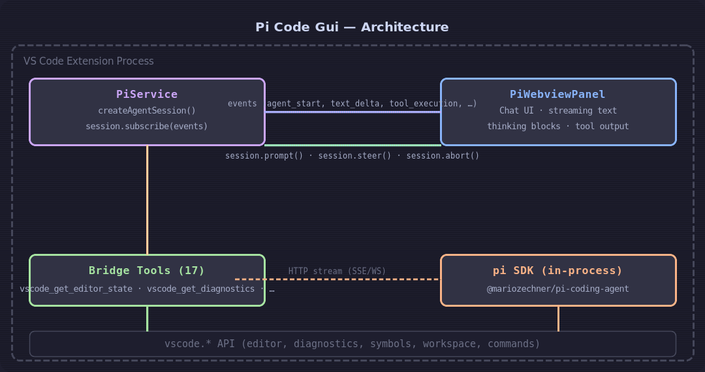

# Pi Code Gui

> A native VS Code editor experience for the [Pi coding agent](https://pi.dev). Runs Pi inside VS Code — not in a terminal — with full access to your editor state, diagnostics, symbols, and more.



## Quick Start

1. **Install Pi**: `npm install -g @mariozechner/pi-coding-agent`
2. **Set an API key**: Run **PiGui: Set Up API Key / Login** from the command palette (`Ctrl+Shift+P`), or set `ANTHROPIC_API_KEY` / `OPENAI_API_KEY` in your environment.
3. **Open the chat**: Click the Pi icon in the activity bar, or run **PiGui: Code Agent** from the command palette.
4. **Start prompting**: The agent can see your editor, check diagnostics, read files, and make edits.

## Why Pi Code Gui?

The Pi coding agent is a powerful AI pair programmer, but the default terminal TUI clashes with the editor workflow — you end up juggling a split terminal, switching contexts, and copy-pasting file paths. This extension embeds Pi directly in VS Code's native UI:

- **In-editor chat** — streaming responses, thinking blocks, and tool execution results rendered in a webview panel, not a terminal buffer.
- **Native VS Code bridge** — 17 tools that call VS Code APIs directly. The agent can inspect your active editor, check diagnostics, find symbols, look up types, apply edits, and format code, all through the same APIs VS Code uses.
- **Session persistence** — conversation history survives VS Code restarts. Sessions are stored in Pi's standard `.jsonl` format alongside your project.
- **Multi-session support** — multiple chat sessions in separate panels, each with independent model and thinking level settings.

## Features

| Feature | Description |
|---------|-------------|
| 💬 **Chat panel** | Streaming text, collapsible thinking blocks, tool call/result rendering, markdown with syntax-highlighted code blocks |
| 🧰 **Editor bridge** | Agent reads open editors, checks diagnostics, inspects symbols/types, applies edits, formats code — all through VS Code APIs |
| 🔄 **Session history** | Auto-saved conversations survive VS Code restarts via `SessionManager.continueRecent()` |
| 🪟 **Multi-session** | Multiple independent chat panels, each with its own model, thinking level, and conversation tree |
| 🌲 **Session tree view** | Browse entries, fork from any message, copy entry text, right-click to reveal in chat |
| 🔐 **Flexible auth** | Runtime API key overrides via VS Code settings, env vars, or the built-in auth config |
| 📋 **Custom slash commands** | `/fix-diagnostics`, `/explain-code`, `/refactor` — plus all standard Pi commands |
| 🔧 **Settings** | Toggle auto-compaction, auto-retry, skills loading, context files, and prompt templates from the UI |

## VS Code Bridge Tools

The agent has native access to your editor through these tools:

`vscode_get_editor_state` · `vscode_get_selection` · `vscode_get_diagnostics` · `vscode_get_open_editors` · `vscode_get_workspace_folders` · `vscode_open_file` · `vscode_check_document_dirty` · `vscode_save_document` · `vscode_get_document_symbols` · `vscode_get_definitions` · `vscode_get_hover` · `vscode_get_references` · `vscode_get_workspace_symbols` · `vscode_get_code_actions` · `vscode_apply_workspace_edit` · `vscode_format_document`

## Architecture

Pi Code Gui loads the `@mariozechner/pi-coding-agent` SDK at runtime from your global npm install. This means `pi update --self` picks up new SDK versions without an extension update.

- **PiService** manages the agent lifecycle: creates the SDK session, subscribes to events, translates them into chat UI messages, handles model/thinking/settings changes, and tracks usage stats.
- **PiWebviewPanel** renders a webview chat UI. It subscribes to PiService events and re-renders streaming text, thinking blocks, tool execution, bash output, compaction summaries, and custom messages in real time.
- **Bridge tools** are registered as SDK `customTools` constructed with `defineTool()` and Typebox schemas, the same way the SDK's own built-in tools are defined.

## Extension Settings

| Setting | Type | Default | Description |
|---------|------|---------|-------------|
| `pi-code-gui.promptToInstall` | boolean | `true` | Prompt to install Pi if not found |
| `pi-code-gui.anthropicApiKey` | string | `""` | Runtime Anthropic API key (overrides env var, not persisted to disk) |
| `pi-code-gui.openaiApiKey` | string | `""` | Runtime OpenAI API key (overrides env var, not persisted to disk) |
| `pi-code-gui.systemPromptAppend` | string | `""` | Additional instructions appended to the system prompt |
| `pi-code-gui.enableSkills` | boolean | `true` | Load project and global pi skills |
| `pi-code-gui.enableContextFiles` | boolean | `true` | Inject project context files |
| `pi-code-gui.enablePromptTemplates` | boolean | `true` | Register custom slash commands |

## Requirements

- VS Code 1.118+
- `@mariozechner/pi-coding-agent` installed globally: `npm install -g @mariozechner/pi-coding-agent`
- At least one API key (Anthropic, OpenAI, DeepSeek, Gemini, etc.)

## Development

```bash
pnpm install          # Install dev dependencies
pnpm run compile      # Type-check, lint, and build with esbuild
pnpm run watch        # Watch mode for development
```

Press `F5` in VS Code to launch the Extension Development Host.

To package a `.vsix`:

```bash
pnpm run vsix         # Creates pi-code-gui-x.x.x.vsix
```

## License

MIT — see [LICENSE](LICENSE) for details.

